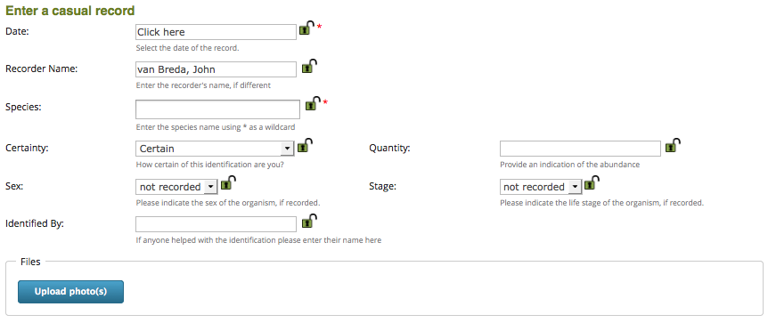

************************
Entering a simple record
************************

.. todo::

  link up the video
  
.. sidebar::

  A video showing you through the steps covered in this tutorial is available.

A wildlife recording system is nothing without the records it contains, so what better
way to start learning iRecord than to input a simple record. The exact information you 
might want to record will depend on what you are recording and why you are recording it, 
but all biological records will need to include the following information:

* Who recorded it
* Where it was recorded
* When it was recorded
* What was recorded

We will normally be logged in to iRecord when we input records, so the system knows who
you are and can use this information to provide the default value for "who recorded it".
iRecord includes a limited number of ways of inputting records even when you are not 
logged into the system but in these cases you would be asked to fill in basic details of 
yourself. As iRecord is far more useful when logged in, we'll be focusing on inputting
data as a logged in user. The other key parts of a record, the "where, when and what" 
will need to be input when you add a record to the system.

.. tip::

  When practicing using iRecord to input records, if you want to input data that are not
  real make sure you turn on the **training** option in your user profile. 
  :doc:`More information on using the training option<training>`.
  
.. todo::

  Add link to the video for this.

To add a record:

1. First make sure you are logged in.
2. Select **Record > Enter a casual record** from the main menu. This takes you to the 
   form which you will fill in for general ad-hoc records. There are other forms for 
   lists of records as well as forms catering for specific surveys, species groups and 
   places which we will learn about later. The top half of this form allows you to set
   most details of the record other than the locality information, which we will come to
   in a moment.
   

  
3. Entering a date