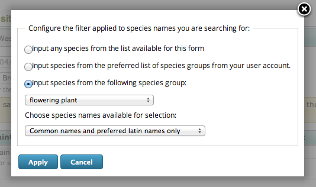

**************************
Tutorial - Data Entry Tips
**************************

Data entry in iRecord is designed to be as quick and intuitive as possible. However, in 
this tutorial we'll take a look at a few tips and tricks which can make things even 
easier. As usual, make sure you are in :doc:`training mode <training>` before inputting
tutorial records.

First, select **Record > Enter a list of records** from the menu to access the standard
form for entering record lists.

Control locking
===============

We are going to input records given to us by a friend, from 2 different places, but on the
same day. Click on the **Date** control and set a date for your records to 14/04/2013.
Now, click the padlock icon to the right of the date box. This locks the control's value
so that it cannot be edited. 

You can see that the date control is now greyed out and the padlock locked, indicating 
that the control value cannot be changed. Try clicking on the date control and you will 
see that it no longer accepts input. The real value of control locking is the control's 
value *will be remembered the next time you use this form*. So, we can use this facility
when we need to input several batches of records which share some of the same attributes
such as the date, place or recorder.

Type "Fred Blogs" into the **Recorder Name** and lock this control as well, since we are
entering more than one batch of records on Fred's behalf.

Inputing lists of species
=========================

Next, click in the input box at the top of the **Species** column in the grid below. 

.. tip::

  Don't forget that you can use the tab key to navigate forwards in the form - this is a
  standard feature of web browsers. Shift tab allows you to navigate backwards.
  
Fred has given us a list of birds plus a list of plants for the first place & date he 
surveyed. This is the list as he wrote it:

* Lords and ladies
* Dog violet
* Greater-Spotted Woodpecker
* Parus caeruleus
* Magpie

Let's start inputting the names. We're going to explore a few of the different issues
relating to finding species names - with a clear understanding of how it works you'll be
able to find names quickly and efficiently. So we'll be deliberately looking at some 
problematic data in order to learn how to handle it. Type "lords and" into the species 
name box. Your search is sent to the server and used to lookup possible species name 
matches as follows:

    
This is an interesting (i.e. deliberately chosen) example. 3 results are shown, but they
are all for *Arum maculatum*, i.e. Lords-and-ladies or cuckoo pint. The reason is that 
iRecord uses the UK Species Index to provide species names and the UKSI lists 3 variants
of the common name Lords-and-ladies with different capitalisation. Another interesting 
point here is that there are hyphens in the common names listed and the names were found
even though we didn't include the hyphen in the characters we typed.

.. tip:: 

  iRecord doesn't care about punctuation and other special characters when you search for
  a species name, so don't bother typing them. In fact, spaces are also ignored - typing 
  "7sp" is enough to find "7-spot ladybird" and would also find 7 spot ladybird if it were
  listed without the hyphen.
  
Rather than pick a name, we'll explore inputting this species name a little further so 
select the text you have input so far and delete it. Now, type "armac" which is 2 letters
from the genus name and 3 letters from the species name. This *should* find the species
for us as iRecord supports 2+3 letter abbreviations as used in some other recording 
systems. However, as there are quite a few species with the same abbreviation, *Arum
maculatum* does not make it to the top. One way around this is to limit the search to 
flowering plants, which is particularly useful if entering a list of many flowering plant
records. 

.. tip::

  When using 2 + 3 letter species name abbreviations, utilise the filter button in the 
  Species column header to limit your search to the appropriate species group(s). This
  works even more effectivel when entering species from a not-so-extensive group as 
  flowering plants.
  
To change the species names filter, click the filter button in the column header of the
Species column. This pops up a dialog box allowing you to configure what names are
available in the search filter. Select the option **Input species from the following
species group** then in the associated drop down box choose **flowering plant**.

    
Click **Apply**. Now, clear the species name input box and type "armac" again. This time
you will find that **Arum maculatum** appears in the list a couple of places from the top.
Use the down arrow key to move the highlighted name down, then hit the return key to 
select it.

The species name is selected and a new row is automatically added to the grid. Note that
the input cursor is put straight into the new box in the Species column ready for you to
continue typing species names. Let's try the next name in the list, written as "Dog
violet". Type this name in. Nothing is found - you can tell this because the rotating
"searching icon" appears briefly and then disappears, indicating nothing was found. One
thing to bear in mind about using the UK Species Index to lookup species names is it
does not understand the vagaries of the ways that we often share names. There are
actually many dog violet species; we happen to know that Fred meant common dog violet,
because we know Fred would have specified if it were something different. But iRecord
can't make these assumptions for you. If you can't find a species name because you know
that there is a part of the name missing, then insert a ``*`` character as appropriate
to act as a wildcard. Insert a ``*`` at the start of the species name input so you are
searching for ``*`` dog violet and you will find that a number of dog violet species are
returned with common a little way down the list. Select it and we'll move on. 

Now that we've input the plants from the list, click the filter button again and this time
set the filter to "Birds" and click **Apply**. 

Since we know that iRecord does not care about capitalisation, spaces, or punctuation, 
type "greaterspottedwood" into the next Species search box. Again, the name is not found
(I did say we'd be deliberately looking for problems to learn how to handle them!). You
might have noticed that we are searching for "Greater" instead of "Great", but assuming 
that we hadn't spotted this problem in the name we've input, a good way forward would be
to search for something like "great*woodpecker", since we know that at least these parts
of the name are unambiguous. 

.. tip::

  The * character is your friend when struggling to find a species name. 

Fred has given us a latin name for the next species to input, *Parus caeruleus*. Input 
this name and, you've guessed by now, the name will not be found. This is because *P.
caeruleus* is the name used for blue tit until a few years ago, when taxonomists realised
it was not actually in the same genus as *Parus major*, the great tit. So, now it is 
known by the new name *Cyanistes caeruleus*, though the previously used synonym is 
sometimes still in use. We don't want to look up the correct name to use every time this 
happens, so another option is to enable searching for synonyms. To do this, click the 
filter button in the Species column header again. This time, change the drop down option 
for **Choose species names available for selection** to **All names including common names
and synonyms**. In other words, all the names available in the UK Species Index become
available for searching, whether they are current or not. Now retype "Parus caeruleus"
and you should find that this time, the name is found. 

As one more illustration of grid based name input, let's try inputting a few dragonfly and
damselfy names to examine the most efficient key strokes. The list we will input is:

  * Beautiful agrion - *Calopteryx virgo*
  * Common Darter - Sympetrum striolatum
  * White-Legged Damselfly - Platycnemis pennipes

Clear the species names you have input so far, and try the following key strokes as 
quickly as you can: 

cavir<return>systr<return>plpen<return>

If you are a quick typist, you will notice that iRecord lets you start typing the species
name for the next row before it has looked up the first row's name. You don't have to 
wait for the species name to be matched, just get on with typing names as fast as you 
like. This works for common names and latin names as well as abbreviations, though you are
obviously more restricted in the speed you can reach. For the last abbreviation, "plpen",
iRecord could not find a unique species name match so the drop down list of possible 
matches is shown. At this point you have to break your flow to click on the correct name.

Now, try the same experiment again, but type the following set of characters. Note the 
missing p in "plpen" which is our pretend typo.

cavir<return>systr<return>plen<return>

This time, if you managed to press return before the search completed for the misspelt 
"plen", then you will notice with a "polite shake of the head" the species name input box
informs you that it failed to find any matches. Time to go back and correct it!

.. tip::

  Practice using the keyboard only to input species and associated attributes into the
  input grid. In time it will become intuitive and is faster than using the mouse.

One more thing, try typing "cavir" into the species search box then pressing <tab> instead
of <return>. This time, the species name is picked but the input focus moves to the next
control in the same row. You can then use the up or down arrow and return key to change 
the certainty of the record, or press tab again to change one of the other column values. 
Press tab a few times to move to the next row when ready to add a new species name, or
shift tab to move backwards. When you are in a text input box (such as **Quantity**, 
**Identified By** or **Comment** you can use the up and down arrows to navigate between
rows, though the web browser reserves these keystrokes for selecting items when the 
focused control is a drop down. 
  
.. tip::
  
  Don't forget to use the record certainty attribute to mark up records which you are not
  certain of the identification for. Also, note that if you are not certain of an
  identification to species level, but are certain of the genus you can always add a
  record at genus level.

Uploading photos
================

The ability to attach up to 4 photos to each record added via the grid is accessed via the
**add images** link in the rightmost column of the grid. It's simply a matter of picking
an image file from your disk to upload.

The file upload system used by iRecord examines the capabilities of your web browser to
determine the best way to upload files. For example, if you are using a modern web
browser with support for the latest standards, then it can resize the image so that the
upload time is fast and show a progress bar for the upload. If you are running an old
browser which does not support the latest web standards, then it will do a standard file
upload which will be slow. If you are uploading multiple images for a batch of records,
then a slow upload speed could become completely unworkable quite quickly. The file
upload system will also make use of installed browser plugins, as either Silverlight or
Flash can make a smoother upload process. The morale of the story is, if you have any
difficulties using the photo upload facility, then I recommend ensuring you are using
the latest available version of your web browser and have the latest versions installed
of your Silverlight or Flash plugins.

    
Map tips
========

.. only:: html

  Watch the video below which shows you through some tips and tricks for using the map.
  Then follow the steps below to have a go yourself.
  
  .. raw:: html

    <iframe width="640" height="360" src="http://www.youtube.com/embed/A_obzNIN8Ws" frameborder="0" allowfullscreen></iframe>
    
.. only:: not html

  .. tip::
  
    You can `watch a video of map tips and tricks
    <http://www.youtube.com/watch?v=A_obzNIN8Ws>`_.
  
Here are a collection of tips and tricks for using iRecord's map during data input. Try
each tip out using the **Record > Enter a list of records** page.

Map Layers
----------

In case you haven't already spotted it, try clicking on the blue **+** button in the top
right of the map. This expands a panel allowing you to choose from the various layers 
available. On the following screenshot, the first 2 are background layers provided by
Google - you can show only one of these at a time. The second 2 are overlays which are 
drawn over the top of the base layer. You can show any combination of these you like.

    
Try changing the settings to see what they do. When you've finished, click the - button
in the panel to close it.

Navigating around the map
-------------------------

Also overlaid onto iRecord maps you will find navigation and zoom buttons on the left hand
side. Although sometimes handy, I prefer to use the mouse left button to drag the map 
around as required and to double click on the map to zoom in. Make sure you experiment 
with these different techniques of moving the map around and zooming in before continuing.

Another way to zoom into a precise region is to hold the shift key, then mouse-drag a 
rectangle on the map. The map will then zoom to show the rectangle. Again, practice
trying this yourself before moving on.

.. tip::

  If you have a mouse wheel, or similarly featured gestures on a touchpad, then you can
  use this to zoom the map in and out.

A third way to zoom the map into a place is to use the **search for a place on the map**
input box on the left to find a town or village by name. Try typing "alfriston" into the 
box then click Search and the map will zoom into the village of Alfriston in Sussex, as
it managed to find a unique place with that name. If you try searching for a more
ambiguous name such as "arlington" you will see that you are given a list of possible
matching places to pick from:

.. image:: images/data-entry-tips-place-search.png
    :width: 500px
    :alt: The place search tool
    
Setting a grid reference for your record
----------------------------------------

The simplest way to set a grid reference for your record is to click once on the map 
where you would like the record to be. Most of the time this is all there is you need to 
know. The following points give you some extra details though:

  1. As you hover over the map, a "ghost" image of the grid square you are about to pick
     is shown. This gives you a preview of the square size and position.
  2. The more you zoom the map in, the more precise the grid reference will be. The map
     won't set a grid reference that is more accurate than could realistically be expected
     from the scale of the map.
  3. When you click to set a grid reference, the map will zoom into the grid reference 
     square giving you a chance to click again to set an even more precise grid reference.
  4. If the map is showing the street map base layer, then when you click on the map to 
     set a grid reference and it automatically zooms in, if the zoom scale is high enough
     the map will automatically switch to satellite view so you can set a precise grid
     reference more easily.
  5. If you hold down the + key whilst over the map, the precision of the grid reference 
     is increased
     
An exercise
-----------

To check you've got to grips with the map, see if you can:

  1. use the map to set a grid reference for a 1m square on the top of the lighthouse
     just off Beachy Head, just to the west of Eastbourne.
  2. Input the following coordinate from a GPS: 51.53865N 0.01659W
  3. Input the following tetrad (2km) grid reference: TR01Y. Use the streets background layer to 
     find out where this is.

