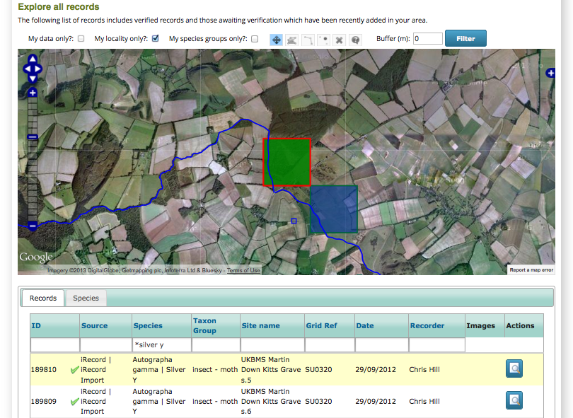
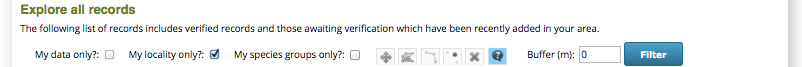

****************************
Tutorial - Exploring Records
****************************

Now we've got to grips with the contents of the **Explore** menu, let's take a guided tour
which will take in some more details. Before following this tutorial through, please visit
your **My Account** page, then go to the **Edit** tab and **Preferences** sub-tab. Change
your **Location** to Dorset. You can change it back again afterwards but this way you will
be able to follow through the steps with roughly the same records. Whilst you are doing 
this, uncheck the **Training** checkbox if it is currently checked so that we can see 
real records.

Now, go to **Explore > All Records**. Untick the **My species groups only?** checkbox
above the map and click the **Filter** button. Your map should look like this:

.. image:: images/explore-tutorial-dorset-map.png
    :width: 700px
    :alt: Records in Dorset map
    
It's kind of all very pretty, but not much use at the moment as it's just a jumble of 
different species dots. So, what can we do with this?

Filter the records table
========================

The table of records below includes quite useful filtering facilities including wildcard
searches. Lets draw a map of records of the Silver Y moth (*Autographa gamma*). To do this
you could type the latin name in the box a the top of the **Species** column, or use a 
wildcard to search for the common name. So, type "silver y" into this box and press
the return key:

.. image:: images/explore-tutorial-silver-y.png
    :width: 700px
    :alt: Records filtered to show Silver Y
    
You can see that not only has the grid filtered, but so has the map. 

Drilling between the map and records table
==========================================

Try clicking on one of the rows in the grid and watch what happens on the map. You should
see that the record is highlighted for you.

Next, double click on the same row in the grid. The map will zoom in to show you the 
records. Use the layer switcher button in the top right of the map to switch to satellite
view:

There are other dots on this map which I'd like to know more about. So, select the map
query tool - that's the blue highlighted button with a question mark in it in the 
following image:

    
Now, click on one of the dots on the map you are interested in. Not only does the dot
highlight, but the grid is refiltered to show just the records under the dot.

.. tip:: 
  
  You can also drag a rectangle to select multiple grid squares to filter on.
  
So, you can quite easily find any record you see on the map in the grid, or find any 
record you see in the grid on the map.

Exploring by species
====================

Reload the page to start afresh again and make sure that the **My species groups?**
filter is turned off as before. This time, click on the **Species** tab in the data panel
to view the list of species. Here are a few things you can experiment with:

  1. Click on the **Number of Records** column title to sort by record count, then click
     again to put the highest count at the top.
  2. Click once in the first row of the grid. This highlights all records of that species 
     on the map. Try clicking in the different rows to see the map update:
     
     .. image:: images/explore-tutorial-highlight-species.png
       :width: 700px
       :alt: Highlighting a species to update the map.
       
  3. Click on the **Species Summary** button for the same row in the list of species. This
     is the button to the right of the row with a magnifying glass icon. This will take 
     you to a details page for that species.
     
     .. image:: images/explore-tutorial-species-details.png
       :width: 700px
       :alt: Exploring the details of a species
       
  4. Click on the **Explore Records of Silver Y** button (assuming that is the species 
     you are viewing details for). This takes you back to the Explore page with all 
     records of that species loaded. 
     
Record tools
============

For each record shown on the Explore page data tables, there are potentially up to 2 
"tools" available in the rightmost column in the grid:

  * All records have a magnifying glass icon which zooms in to show you the details of a
    record. 
  * Records which you have entered yourself have an edit icon which returns you to the 
    original data entry form for the record. Note that if you edit a record that has been 
    verified, or is part of a form submission that contains records which have been 
    verified, then these records will need to be reverified to check they remain accurate.
    So don't edit records that have been verified unless there is a good reason to do so. 
  
.. tip::
  
  The record details page lets you add a comment to the record which will be sent back to 
  the recorder. For example you might like to let them know if you agree or disagree with
  an identification.
     
To round this tutorial off, see if you can find the record of the queen *Bombus 
terrestris* you entered earlier and edit it to change the grid reference. A hint - because
this record was entered in training mode, you will have to set training mode on your **My
Account** page.
