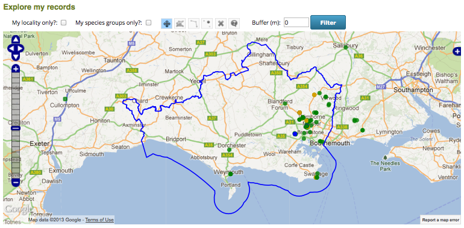
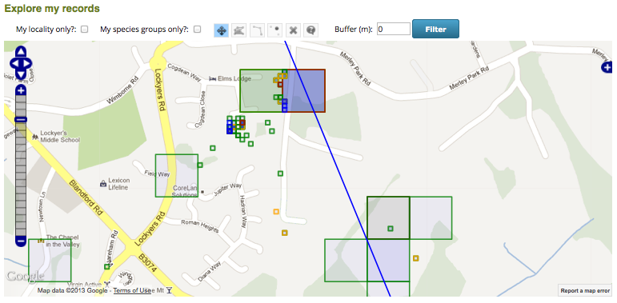
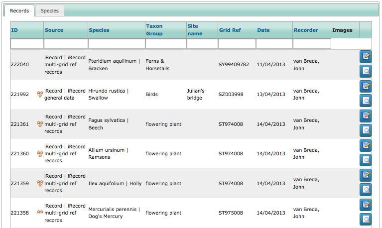
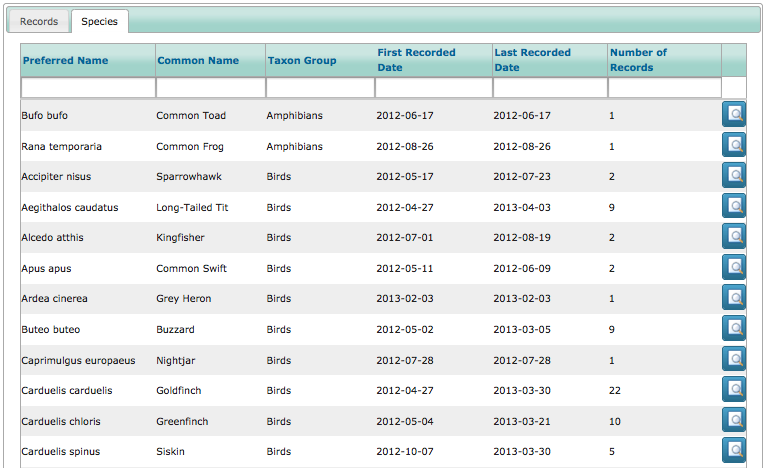
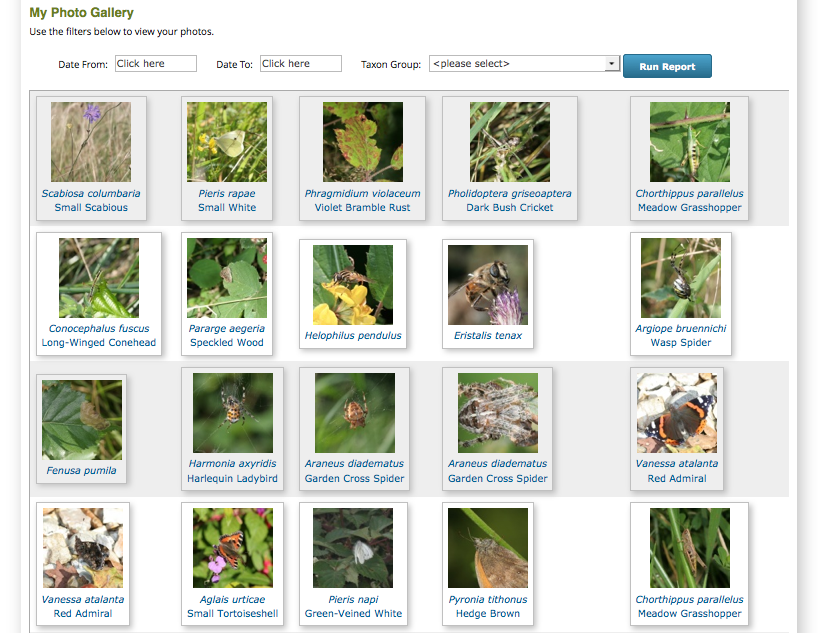
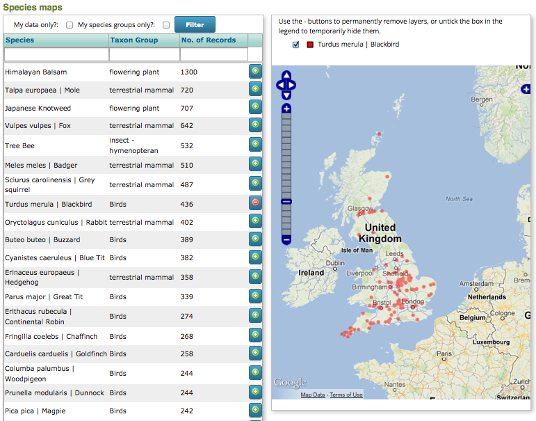

*********************
Exploring the records
*********************

One of the key features of iRecord is that non-sensitive records are immediately visible
to other users. This allows you to see what is being recorded near your patch or by your
friends and colleagues. In this section we will take a look at the Explore options 
available in iRecord for browsing existing records.

.. tip::

  Whilst exploring records, don't forget that the records you see will be those recorded
  in training mode if you are in training mode yourself. Training modes will be excluded
  from the reports if you are not in training mode!

Exploring Records
=================

First, select **Explore > My Records** from the menu. The Explore page will open, filtered
to show your records. If you have selected your preferred recording location in **My 
Account** then the map will be zoomed to show that location's boundary. The **Explore >
All Records** page is exactly the same in functionality, but not initially filtered to 
show your own records.

The Explore pages are divided into 2 parts, a map panel and a data panel as described 
below.

Map Panel
---------

.. todo:: 

  image

The map shows records that match the current filter; in this case the filter is all
records input by me. When you are zoomed to show a distant view of the map, a small grid
square would simply not be visible so iRecord automatically draws a larger circle over the
record until you are zoomed in far enough to show the record as a proper square. This 
map image shows the appearance of records when you are zoomed out:

    
And here are the same records, shown when zoomed in:

    
So, what do the various colours mean? The line drawn around the grid square and the circle
drawn when zoomed out both indicate the certainty of the record. For an unverified record,
this is the certainty of the record according to the recorder, but once a record is 
checked by an expert then that expert's opinion overrides the opinion of the original
recorder. So, we see the following colours:

  * Blue = unknown certainty & not yet checked by an expert
  * Red = low certainty, or record has been rejected by an expert
  * Orange = medium certainty, or record has been marked for querying by an expert
  * Green = high certainty, or record has been verified by an expert.
  
The fill colour of the grid square always shows the expert's opinion:

  * Blue = not yet checked
  * Red = record rejected
  * Orange = record marked for querying
  * Green = record has been verified.
  
So, load up your own **Explore > My Records** page and zoom in on some of the records to 
see how they appear on the map. In a moment we'll take a look at how you can examine the 
underlying data for these map points.

Data Panel
----------

Underneath the map there is a data panel which shows a list of records currently loaded on
the map:

    
In this grid, details of the record including any photos are shown. The icon in the 
species name column gives an indication of the record's quality:

  * One star - record not yet checked by an expert and marked as uncertain by the 
    recorder.
  * Two stars - record not yet checked by an expert and marked as likely by the recorder.
  * Three stars - record not yet checked by an expert and marked as certain by the 
    recorder.
  * Red cross - record checked by an expert and rejected. Note that you will only see 
    rejected records on the Explore My Records page, not when viewing records from other
    users.
  * Amber question mark - record checked by an expert and marked for querying.
  * Green tick - record checked by an expert and confirmed.
  
The data panel also shows a list of the species currently loaded on the map on the second 
tab:

    
Explore > My photo gallery
==========================

For those of you who like to collect a gallery of your own images, the **Explore > My
photo gallery** menu item provides exactly that:

    
There are simple filters based on date range and species group to help you look up photos.
For more advanced filtering options, your photos are presented in tabular form on the 
other explore pages.

Explore > Species Maps
======================

Select the **Explore > Species Maps** menu item. This page provides a really quick and
easy way to draw maps of the various species data held in iRecord. 

Simply search for the species you want to map in the table on the left and use the + 
button to add a map layer for that species. You can:

  * Add up to 4 species layers to the map at once
  * Filter to show only your own records
  * Use the filter row in the top of the species table to search for a species by name.