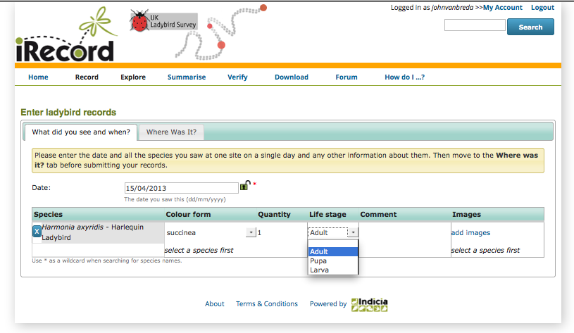
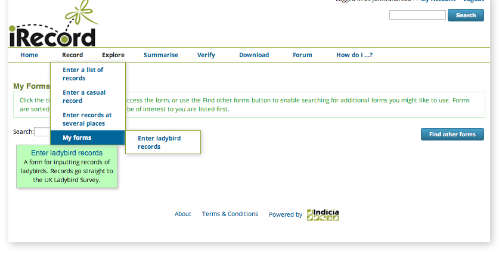

***********************
Using the Forms Library
***********************

Throughout the tutorials so far, we've been concentrating on using the general purpose
recording forms. These are quite basic in terms of the attributes that you can record with
each record, for example you can't provide detailed life stage information in the 
**Stage** field since the field's values are general purpose. As well as more specialist
recording forms, iRecord also allows groups, schemes and societies to add forms for their
own purposes, with attributes and options appropriate to them. These are available on the
**Record > My Forms** menu item. Some examples include:

Enter ladybird records
======================

This form was designed by the UK Ladybird Survey and includes colour form and life stage
attributes:

    
National Trust Dorset site recording forms
==========================================

Forms were designed by surveyors of 2 National Trust sites in Dorset, Burton Bradstock and
Golden Cap Estate:

    
Intertidal Recording Form
=========================

This form was designed to capture intertidal records specifically:

Because of the way that iRecord was developed, adding new custom forms such as these is a
fairly simple process, so the library of available forms is likely to continue growing. 

Let's take a look at how the forms library works. Visit the menu item **Recording > My
Forms**. The forms library allows you to pick and choose which forms you would like to 
"favourite", meaning which forms you would like easy access to. You can access any of the 
other forms at any time, they just aren't made quite as convenient to access. When you 
first visit this page, you won't have any forms favourited, so it will show you all the 
available forms:

.. image:: images/my-forms-find-other-forms.png
    :width: 700px
    :alt: Browsing the forms on the My Forms page.

This is the **Find other forms** mode, indicated by the button on the top right being
pressed in. In this mode you can click on the title of any form to use the form, or you
can click the **Add to favourites** button associated with one of the forms to add it to
your list of favourites. Let's add the ladybird recording form to our list of favourites
by clicking it's button. The form is highlighted and the button changes to a **Remove from
favourites** button showing that it is on your list. 

Now, reload the page. Because you have at least one form in your list of favourites, the
page will now with the **Find other forms** button not pressed in, so you are able to list
just the forms you've favourited. Even more importantly, if you hover over the **Record >
My Forms** menu item you will see that the form(s) you have favourited are now listed as
sub-items ready for you to access at any time.

    
When using the **Find other forms** mode, you might think that it looks like a chaotic
disordered jumble of forms. In fact, they are sorted so the ones which overlap your 
species group interests and recording locality are listed first and ones which are less
relevant to you are listed lower down. There is also a search facility to help you find
forms.