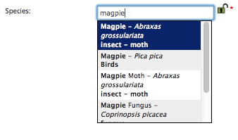

Tutorial - Enter a casual record
================================

Since we've already used the **Enter a casual record** form when we :doc:`added a simple
record <../a-simple-record>` earlier, we'll take this opportunity to take a look in more
detail at the standard attributes we capture for each record in iRecord.

Date
----

Put simply, when the record was recorded. This field does not allow future dates to be 
input. 

Recorder Name
-------------

This will default to your own name. When entering data on behalf of someone else, or a 
group of people, use this field to specify who.

Species
-------

The species name, as looked up from the `UK Species Index <http://www.nhm.ac.uk/research-curation/scientific-resources/biodiversity/uk-biodiversity/uk-species/index.html>`_.
This supports data input using latin names and common names. Note that internally, whether
you use the latin name, common name or even a synonym for data input, iRecord understands
the species concept you are referring to. So you can't cheat - a record of Wren plus a 
record of *Troglodytes troglodytes* does not make 2 species on your bioblitz checklist!

When you pick a species name, iRecord shows you the species group you are picking from in 
the drop down list of options. This helps prevent mistakes where common names are used to 
mean different things in different species groups, such as magpie (moth, fungus or bird?), 
redshank (flowering plant, moss or bird?). 

    
Certainty
---------

Although most records are put on iRecord with a relatively high degree of confidence in 
the identifications, there are many reasons why iRecord should accept less than certain
records. 

  * Uncertain records can still act as a pointer to others who may want to confirm 
    the record themselves. 
  * An uncertain record as determined by the recorder might be accompanied by enough 
    information for the record to be verified by an expert.
  * Most recorder's like to keep all their records for the sake of completeness, not to 
    have to discard the ones that they cannot be 100% certain of. This is especially 
    important to the newcomer recorder who might one day be the expert verifying my 
    records.
    
Therefore, always set the certainty of your record's identification as it ensures that
the record is not misinterpreted or misused.

Quantity
--------

As this is a general purpose record form, the **Quantity** field is a free text input box.
You can give a count here if appropriate, or some other indication of abundance. 

Sex
---

Again, this is a general purpose form and this field may not be appropriate to all 
records, but where possible set the sex of the organism if you can. 

Stage
-----

Again, this is a general purpose form and this field may not be appropriate to all 
records, but where possible set the stage of the organism if you can. Note that iRecord
does support more specialist recording forms, e.g. the UK Ladybird Survey's recording
form, where the list of options for the stage is more specific.

.. image:: ../images/enter-casual-record-ladybirds.png
    :width: 700px
    :alt: The ladybird recording form on iRecord

Identified By
-------------

Knowledge of who identified a record is a really important piece of information when 
verifying the records. Therefore, if the record was identified by someone other than 
yourself, please ensure you specify their name in the **Identified By** box.

Location
--------

The site name you recorded at, or other brief description of the location. 

If you enter a site name and pick a grid reference for a site that you are likely to 
record at again in the future, then click the **Remember Site** button which appears. This
will add the site to your :doc:`../my-sites` page where you can edit the site boundary and
explore the records from that site.

Spatial Reference
-----------------

Provide a British National Grid Reference. You can also input a latitude and longitude
value, e.g. from a GPS. 

.. only:: html

  See :doc:`../data-entry-tips` for lots of tips on how to set the map reference of your
  records.

.. only:: not html

  The :doc:`../data-entry-tips` section gives lots of information on how this value can be 
  set easily, which we'll cover later.

Habitat
-------

If you are able to provide information on the habitat the record was found in, then it
can be a very useful part of the record. The habitat input is a hierarchical list - you
first pick the broadest category of habitat, then the next level. If you are only 
confident in picking the first level, then it is better to do that than to set an 
incorrect second level.

For those that are interested, the habitats available for selection on the iRecord 
general purpose forms are based on the `EUNIS habitat types <http://eunis.eea.europa.eu/habitats.jsp>`_
classification, a standard widely used across Europe. 

.. tip::

  If you use one of the sites on your **My Sites** list, then the last input habitat for
  that site will be automatically selected for you.

Comment
-------

Use this box to provide any additional information you think might be relevant to the 
record.

Exercise
--------

To make sure you've got to grips with all this, ensure you are in :doc:`training mode
<../training>` and then enter the following records:

  1. A record of a queen *Bombus terrestris* (buff tailed bumblebee), seen looking for 
     nesting sites on 4th April 2013. The grid reference was ST99550006. As you are not
     a bumblebee expert, you are trusting that Mr Smith (a passing walker) was correct in 
     the identification, so you can't be certain.
  2. A record given to you by Mrs Sally Green of a hobby, from 20th August 2012. Site name
     was Badbury Rings, grid reference ST966029. She is a known bird recorder so this is
     pretty certain. The habitat was a dry grassland. 

