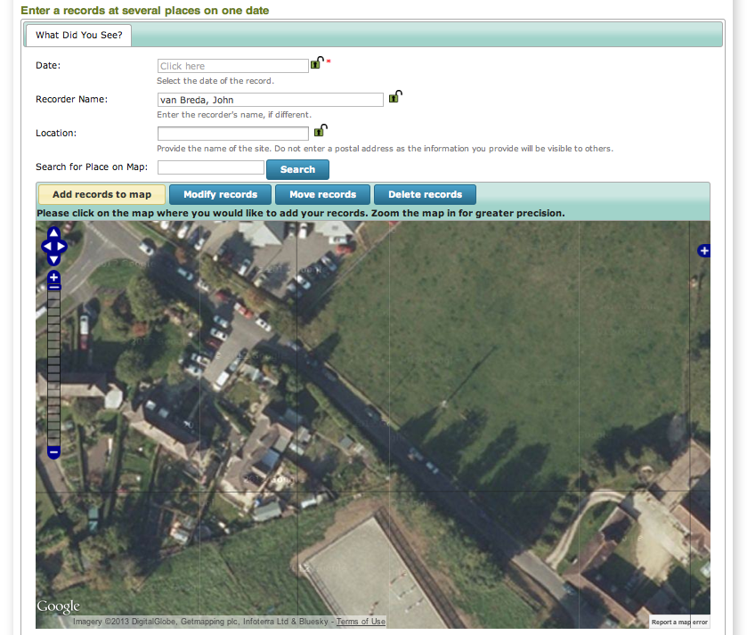
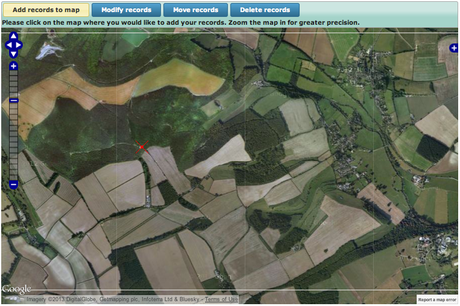
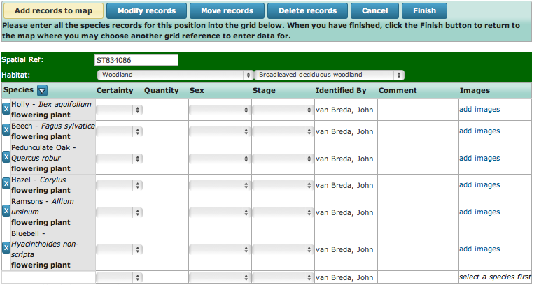
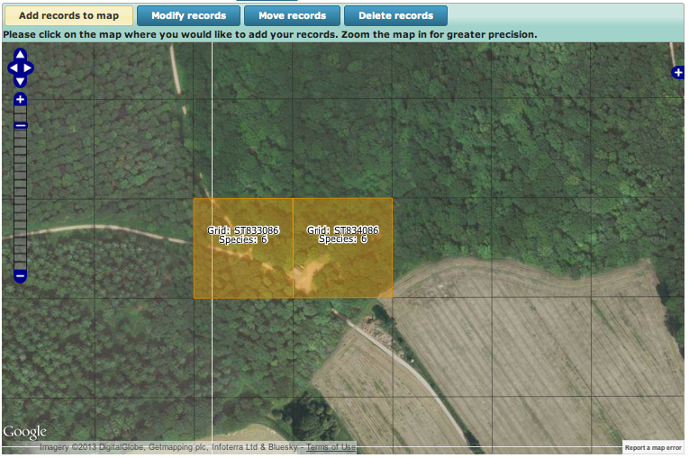
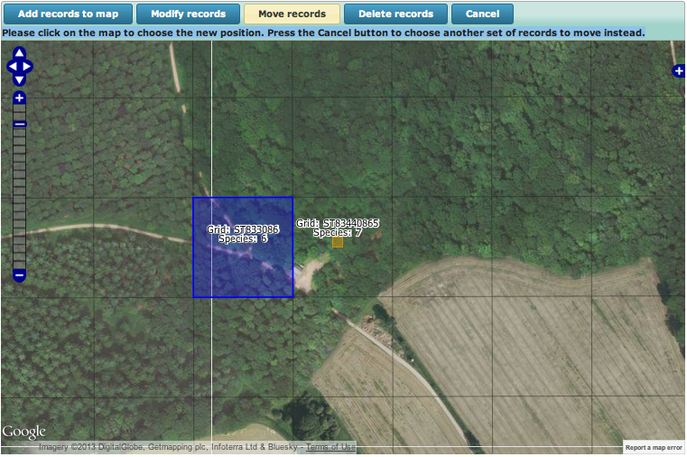

Tutorial - The Enter Records at Several Places Data Entry Form
==============================================================

Although entering a list of records from one place on one day can be a quick way of 
inputting lists of records, most recording trips involve records from more than one grid
square. The **Enter Records at Several Places** form is designed to handle this quickly 
and efficiently - you can add a number of grid squares to a map and enter any number of 
records you like at each grid square.

.. only:: html

  Watch the video below which shows you how to input records at several places. Then 
  follow the steps given further down the page to have a go at inputting some records
  yourself.
  
  .. raw:: html

    <iframe width="640" height="360" src="http://www.youtube.com/embed/JTpwXcQkbWw" frameborder="0" allowfullscreen></iframe>
    
.. only:: not html

  .. tip::
  
    You can `watch a video of using the Enter Records at Several Places data entry form
    <http://youtu.be/JTpwXcQkbWw>`_.
    
During this tutorial, you will enter records from several grid squares. We'll guide you 
through entering some fictitious records but at the end of the tutorial feel free to 
input some of your own records if there is time. 

Make sure that you are logged into iRecord and use :doc:`training mode <../training>` to
ensure that your records do not become live.  Get started by selecting **Record > Enter
records at several places** from the menu. Parts of the form should look quite familiar by
now, but as we will see there are a few big differences on this form to the way other
forms work which allow us to easily add records for multiple grid squares. Select 12th
April 2012 as the **Date** and leave the **Recorder Name** field with its default value.
In the **Location** box, type "Blandford forest". We need to find the right place on the
map, so select **Google satellite** using the layer picker on the map (the blue cross
button near the top right of the map). Our records are a little west of a village called 
Durweston in Dorset, so type "Durweston" into the **Search for Place on Map** box and 
press **Search**. Your form should look like the following, showing the centre of 
Durweston village:

Use the zoom bar on the left of the map to zoom out about 5 clicks, then drag the map so
that the village is towards the right. You should see Blandford forest as in the map 
below. I've marked the visitor centre at the entrance to Blandford forest with a red
cross as this is the approximate location of our first set of records.

    
Use the pan and zoom controls on the map to zoom in so that the forest more or less fills
the map. We could of course zoom right in if we wanted to provide greater precision. Click
on the grid square which has the clearing containing the visitor centre in the bottom 
left. This will set up our first grid square ready to input records; the map will slide
out of view to be replaced by a grid allowing input of the records at this grid reference.

.. tip::

  If you record regularly at a site, don't forget to use the :doc:`../my-sites` feature
  to make finding repeat sites really easy!

First, set the **Habitat** to "Woodland", then choose "Broadleaved deciduous woodland" 
from the subcategory box which appears.

Enter the following records:

* Holly
* Beech
* Pedunculate Oak
* Hazel
* Ramsons
* Bluebell (*Hyacinthoides non-scripta*)

Our grid should look something like the following:

We can of course specify additional details for any of these records if required. Click
the **Finish** button to the top right of the grid when you are ready to continue to add 
the next grid square. 

Next, we'll add some records from just down the track. Click on the next grid square to 
the left (where the track forks) to set the position for the next batch of records. This 
time set the habitat to "Woodland" > "Mixed deciduous and coniferous woodland" and enter
the following list:

* Scots pine
* Pedunculate Oak
* Hazel
* Gorse
* Wild strawberry
* Bramble

Click the **Finish** button when you are done. The map now shows both the grid squares
you've added records for with a brief summary; having zoomed in a bit my map looks like 
the following:

    
We can of course continue to add lots more records at further grid squares, but since the 
aim of the game here is to learn how to use the form's features rather than to put records
in, lets take a look at some of the other things you can do. First, we can add an extra
record to one of the existing grid squares. Click the **Modify Records** button above the
map. Note how the instructions just beneath the buttons changes to tell you what to do:

**Please select the records on the map you wish to change.**

So, simply click on the first grid square at the visitor centre. This returns us to the 
grid view of the records where you are free to add new records, details of records or to
remove records you no longer want to add. Try adding wood anenome to the list and click
Finish when you are done. 

Next, let's try increasing the precision of this grid square. The records were actually
recorded at the north east of the car park clearing by the visitor centre. Click on the 
**Move Records** button so the instructions now say:

**Please select the records on the map you wish to move.**

So, click on the grid square over the visitor centre. The instructions change to:

**Please click on the map to choose the new position. Press the Cancel button to choose 
another set of records to move instead.**

Zoom the map in until you can set a 10m grid square (the "ghost" image under the mouse
cursor shows you how precise the grid square will be when you click). Click on the map
just to the top right of the clearing. You should see something like:

    
Since this is a tutorial, try using the **Delete records** button to remove one of your 
grid squares. 

Now that you are armed with the skills required to use this form, practice entering a few
more records to make sure that it is all clear. You can also try saving records (in 
*training* mode of course) then using the **Explore > My Records** view to edit the 
records again and correct the positions of grid squares or other details of the records.