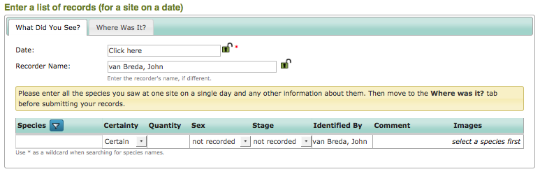

The Enter a List of Records Data Entry Form
===========================================

This form is designed for quickly entering a list of records that were collected at the
same place, on the same date, by the same person. Each record added on the **Enter a List
of Records** data entry form has exactly the same information as the :doc:`Enter a Casual
Record <enter-casual-record>` form. The big difference is that you only input information
about the visit once and you use a grid to enter a list of all the records that share the
same visit information. Another difference is that the form is divided onto 2 tabs, with 
information about the place you visited on the second **Where Was It?** tab.

Entering the date, recorder name and visited place information is exactly like entering 
these details on the :doc:`Enter a Casual Record <enter-casual-record>` form. So, we'll 
take a quick look at the different part which is the species input grid:

    
Inputting records is simply a matter of typing species names into the first, **Species**
column. This matches the text you input against the list of known species names, exactly
as when you are inputting a single record. Once you have input a species name, a new row
is added to the bottom of the grid letting you continue adding more species records. 
When you add a row to the grid for a species record, you can also set the following
attributes of the record:

  * Certainty
  * Quantity
  * Sex
  * Stage
  * Identified By
  * Comment
  * Images
  
Exercise
--------

To ensure that you have got to grips with this form, try inputting the following records
using :doc:`training mode<../training>`.

The records are of wood anenome, bluebell, common dog's mercury and ramsons. All the 
records are certain. The date was 15th April 2013, grid reference TQ566077, site name
Abbot's Wood. 