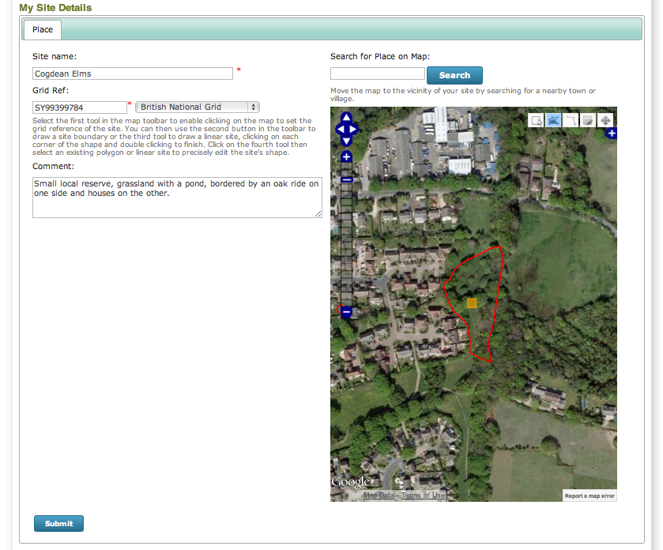

*******************
Tutorial - My Sites
*******************

The My Sites facility in iRecord is a great way to keep a personal list of sites you 
regularly record at. You can also add sites selected from a standard list of sites to
your own personal list, currently the sites available are the National Nature Reserves
but other site types may be added in future.

Follow through the steps below to add one of your local recording patches to your account.

  #. Select **Explore > My Sites** from the menu. Click the **Create Site** button near 
     the bottom of the page to start adding a new site on the Site Details page.
  #. Enter a name for your site into the **Site Name** box.
  #. Use the **Search for Place on Map** box to search for a nearby town or village. Once
     you have zoomed the map to the vicinity of your site, use the methods of panning and
     zooming your map until the map includes all of your site boundary.
  #. Select the leftmost tool in the row of toolbuttons at the top of the map. This tool
     lets you specify the centre grid reference of your site. Click once on your site's
     approximate centre to set this.
  #. Specify a comment for your site to describe it.
  #. Using the map layer panel, switch to Google Satellite as your base layer.
  #. Since our site is a polygon (it could be a linear site), choose the next tool to the 
     right which is the draw polygon tool.
  #. Now, click once on the map on a corner of your site. Work your way around the site 
     boundary, clicking once for each change in direction of the site boundary to 
     gradually build up the shape of your site. Double click to finish once you have
     completed the boundary.
     
My site details form now looks like the following:

   
Press the **Submit** button to complete the site creation process. Now, let's try adding
a casual record for our patch. Make sure that your account is in :doc:`training mode 
<training>` before going any further!

  #. Select **Record > Enter a casual record** on the menu.
  #. Set a record for today's date and choose any species you would like to record.
  #. In the **Location** box, type the first few characters of the name of the site you
     just created. iRecord will search against your list of sites and find the matches. 
     When the site name appears, select it. iRecord will zoom the map straight in to show
     the site boundary for you. 
  #. Click once on the map to set the grid reference, zooming in further first if 
     necessary.
  #. Set the **Habitat** as appropriate for your record. Note that this value will be 
     remembered for you the next time you record at this site.
  #. Save the record.
  #. Go back to the **Explore > My Sites** page. This time, click the **Explore** button
     beside your site. This takes you to the explore page, filtered to show your records
     from that site. Because I'm cheating and have already recorded lots of records at my
     patch, here's a screenshot of the site I created:
     
     .. image:: images/my-sites-explore.png
       :width: 700px
       :alt: Exploring the records at a site
       
.. tip::

  You can use the date filters at the top of this page to filter the records by date. I've
  set myself a target of 365 species records in my garden for 2013, so I can use this to
  check on my progress easily. I'm woefully behind!
     
  

