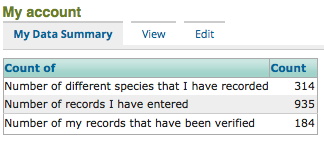
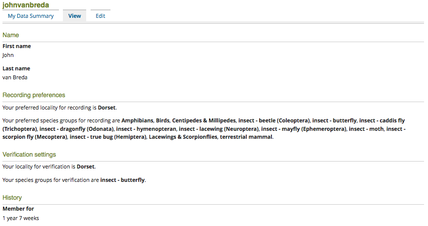
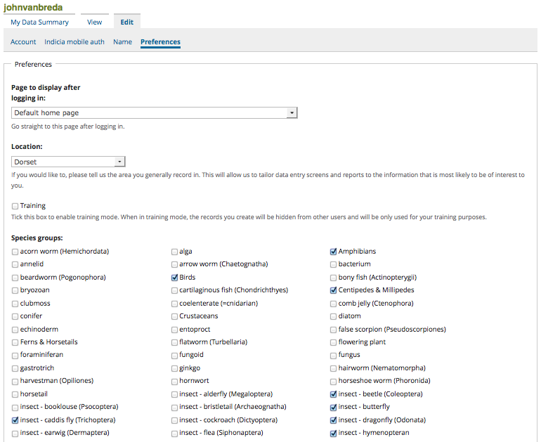

*********************
Tutorial - My Account
*********************

iRecord allows you to customise several aspects including the species groups you like to 
record most often and the region you most often record in. These are then used to 
customise reports and can also be used to simplify data entry or to bring to your 
attention any recording forms which might be of interest, so it's worth spending a few
moments familiarising yourself with the possibilities.

To access your account, click on the **My Account** link in the top right of any page.

The My Account section is divided into 3 tabs as follows:

The My Data Summary Tab
=======================

This tab shows a very simple summary of the records that you have added to iRecord so far:

    
The View Tab
============

The View tab shows a summary of your settings, for example:

    
Note on this tab the section called **Recording Preferences** which tells you whereabouts 
like to record and what I'm mostly interested in. We'll find out more about this later.
In this screenshot, for illustration purposes it shows that I am a verifier for records of
butterflies in Dorset (I'm not, but that wouldn't be a very good illustration without a 
bit of tweaking!)

The Edit Tab
============

The Edit Tab is divided into 3 further sub-tabs. The one we are interested in is called
**Preferences**:

    
On this page, please set:

  * **Location** to the locality you most often like to record in.
  * **Species groups** to the species groups you are most interested in.
  
Note that the list of locations available to pick from uses the list of *Watsonian Vice 
Counties*. These are often used in biological recording since they are persistent and 
not subject to the changes that our list of administrative areas are subject to.

Also note that the list of species groups available correspond to the species group
reporting categories used by the UK Species Index. We are in the process of reviewing 
these to make the options simpler.

When you have set the options remember to click the **Save** button at the bottom of the 
page.