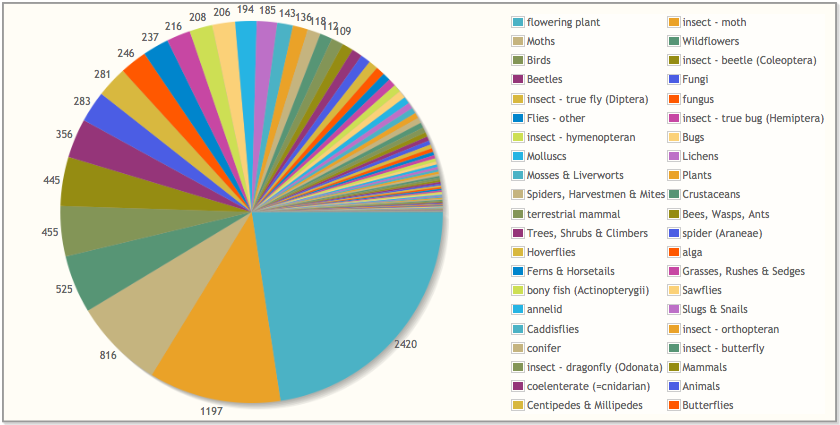

***************
Summary Reports
***************

The **Summarise** Menu option provides access to some quick and simple ways to view data
summaries from iRecord.

General Summaries
=================

Click on the **Summarise > General Summaries** menu item to access a collection of reports
summarising the records you have entered as well as the records entered into iRecord as a
whole.

    
Hopefully the report titles are fairly self-explanatory. Here are a couple of examples

The **My records density map** page provides you with a vice county level heat map of 
where you have input your records:

    
The **Species by group** pie chart shows the relative number of species recorded in each
species group:

    
.. tip::

  Have a play with the different charts available and try clicking on the pie segments, 
  chart bars and map regions to quickly access a filtered version of the **Explore** page
  showing the underlying records and species. 
