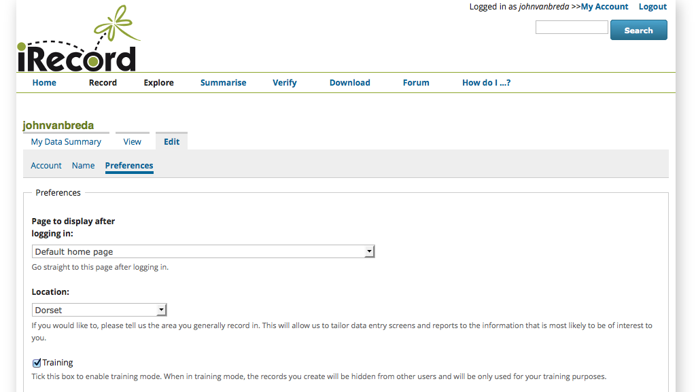
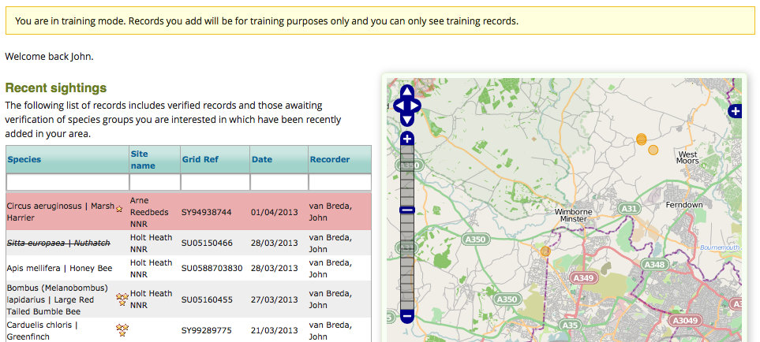

******************************
Using Training Mode in iRecord
******************************

Whilst learning iRecord, you will want to go through the steps of actually submitting
records into the system and seeing the results. If you are concerned about putting
records into iRecord whilst you are still learning the ropes then don't worry as iRecord 
supports a training mode. Whilst in training mode:

  * the records you add are flagged as training records so they won't be sent on to 
    experts, local environmental record centres or the NBN Gateway.
  * training records are hidden from view for all users of iRecord unless they are also in 
    training mode.
  * filter the reports you see so that you can see the training records.
  
.. only:: html

  The following video guides you through turning on training mode, or you can read the 
  steps detailed further down the page.
  
  .. raw:: html

    <iframe width="640" height="360" src="http://www.youtube.com/embed/PBq73EDZ95w" frameborder="0" allowfullscreen></iframe>
    
.. only:: not html

  .. tip::
  
    You can `watch a video of how to set iRecord into training mode <http://youtu.be/PBq73EDZ95w>`_.
  
To enable training mode, follow these steps:

  1. Select **My Account** from the link in the top right of the screen.
  2. Click on the **Edit** tab, under the **My Account** title.
  3. Click on the **Preferences** tab.
  4. Tick the **Training** checkbox.
  5. Scroll to the bottom and click the **Save** button.
  
The following screenshot shows the My Account link, Edit tab, Preferences tab and Training
checkbox:
  

Once you are in training mode, you will find that a message is displayed at the top of
each page warning you. You can see from the following screenshot that the records visible
on the home page are those which I've previously input whilst in training mode.

Don't forget to unset the training option when you want to start inputting live records!
When you do this, your training records will remain in the system but will be hidden from
your view until you choose to return to training mode.