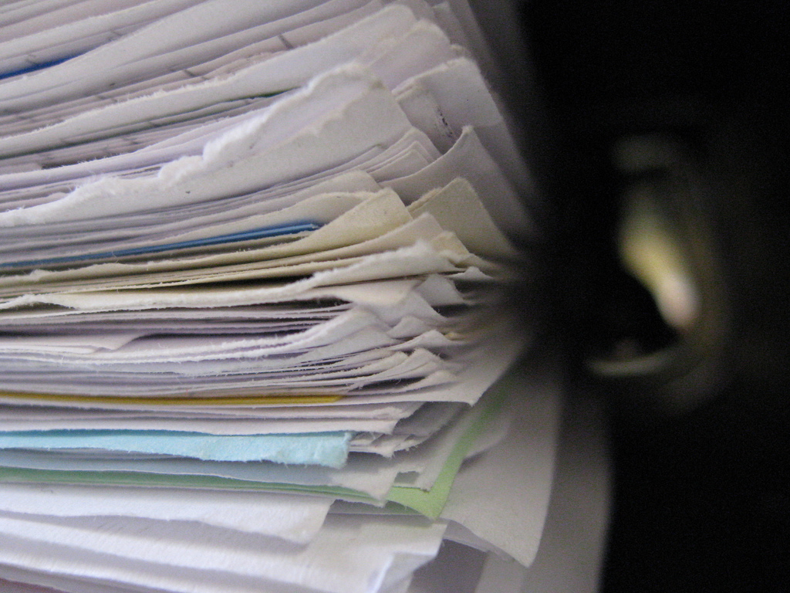
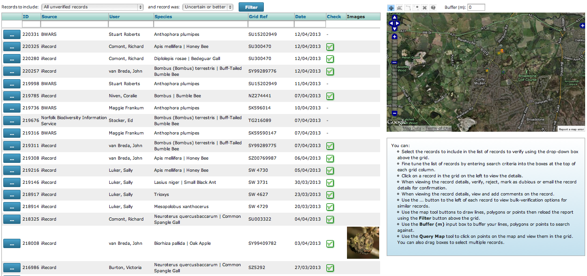
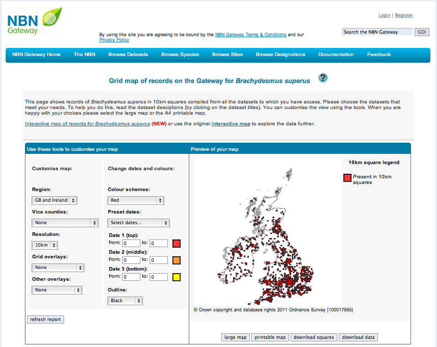

*************************
Where does the record go?
*************************

One of the big benefits of iRecord over using pencil and paper and even some other
computerised recording systems is in relation to where your records go after you submit
them. Many recorders are motivated to record wildlife because they want to ensure that
records are available to decision makers, planning authorities, scientists, recording
schemes and societies. Records on paper need considerable effort to get them into a form
where they can be utilised. Even records in spreadsheets take considerable effort to
import them into the databases used to collate records, since species names and other
terms all need to be matched with the correct equivalents in the database. This might
sound trivial but don't forget that many species names are not unique; a redshank is a
plant *or* a bird for example. A combination of the effort required to process records and
the lack of awareness of the importance of collating records means that many records
remain exactly where they started out - on paper or on a spreadsheet. 

iRecord helps you to match species names correctly at the point of data entry by showing
you the common name, latin name and species group when you pick a name, so issues with
matching names are no longer a factor. The record is immediately in digital form with
correctly input grid references picked from a map, no ambiguity in the way dates are
written and so forth. Therefore fully utilising the records which are input into iRecord
becomes much simpler. Creating an accurate record right from the outset is only part of
the story, so lets take a look at what else happens next behind the scenes.

The Database
============

All records added to iRecord go straight into a database hosted by the `Biological Records
Centre <http://www.brc.ac.uk>`_ known as the *community warehouse*. This reflects the fact
that the database is shared with a community of other online recording websites for 
reasons which we will come to later. The records are held securely and are regularly 
backed up.

Records are immediately available
=================================

All records added to iRecord are immediately available for browsing on the Explore pages
of the website. Also, *records are immediately available for download by local 
environmental record centres and other relevant non-commercial schemes and societies*.
This means that important unverified records can be immediately brought to the attention
of record centres as part of the planning decision process - the record should of course
be verified or re-confirmed before it is used as any sort of evidence. 

Automated checks
================

Records added to the database are subjected to a number of automated checks. For 
example, if a record is outside the expected distribution of the species or at an 
unexpected time of year, then a flag is added to the record marking it as such. These 
flags shouldn't be considered as an indication of a "bad" record though - a record which 
is outside the known distribution is exactly the sort of record which can show the 
movement of a population if enough evidence is available to verify the record.

If you are interested in finding out more about how the rules are decided upon, then you
need to know that the rules used for the automated checks are imported into iRecord's 
processing systems from the `NBN Record Cleaner <http://www.nbn.org.uk/record-cleaner.aspx>`_, 
an application designed to help experts quickly verify records. The parameters used for 
the rules themselves are authored by the relevant recording schemes.

Expert Verification
===================

The next, critical step in the journey of the record is a review by an expert. Only 
expert verified records can be used as evidence in planning enquiries, species atlases
etc. That doesn't mean a record that cannot be verified is not useful; even if it only
gives guidance for further professional surveying every record is valuable. 

Experts have access to a list of the records pending verification, which is filtered to
their region and taxonomic speciality as appropriate. They also have tools to quickly
verify records (e.g. verify *en masse* all records of common, easily identified bird
species by trusted recorders). Photos uploaded with records can be a great help in
verifying records of some species groups but in many cases the expert needs to contact the
recorder to check further details or to ask if a specimen is available. iRecord's
verification system includes tools to make all these tasks as simple as possible for the
expert so that they can concentrate on the important task of checking through the records. 

    
The above screenshot shows the verification system in iRecord. Notice how the verifier is 
able to verify records from multiple places from a single screen - in this case, iRecord,
`Norfolk Biodiversity Information Service <http://www.nbis.org.uk/>`_ and the `Bees, Wasps
and Ants Recording Scheme <http://www.bwars.com/>`_.

Earlier we mentioned that the community warehouse database hosts records from several 
different wildlife recording websites. This means that experts can verify records from all
the systems in one place - not only do they not have to log in multiple times, but they
don't have to learn multiple systems. There are of course other online recording tools 
around with their own verification systems but with iRecord we are at least attempting to 
avoid making things harder than they need to be. 

Records are passed to the NBN Gateway
=====================================

The NBN Gateway is the UK's portal for exploring biodiversity data, a *node* of the
Global Biodiversity Information Framework (GBIF). All verified records from iRecord are
passed to the NBN Gateway's database and from there they are made available to GBIF.

    
The NBN Gateway makes iRecord records available to non-commercial individuals and 
organisations.